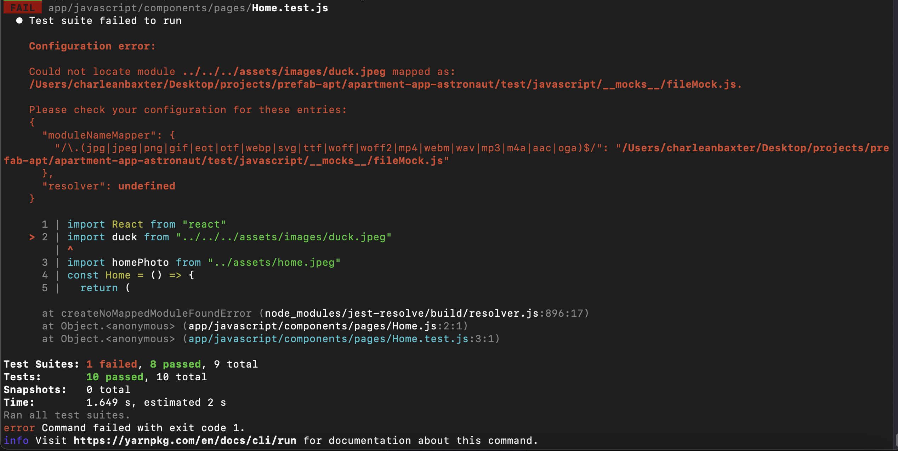
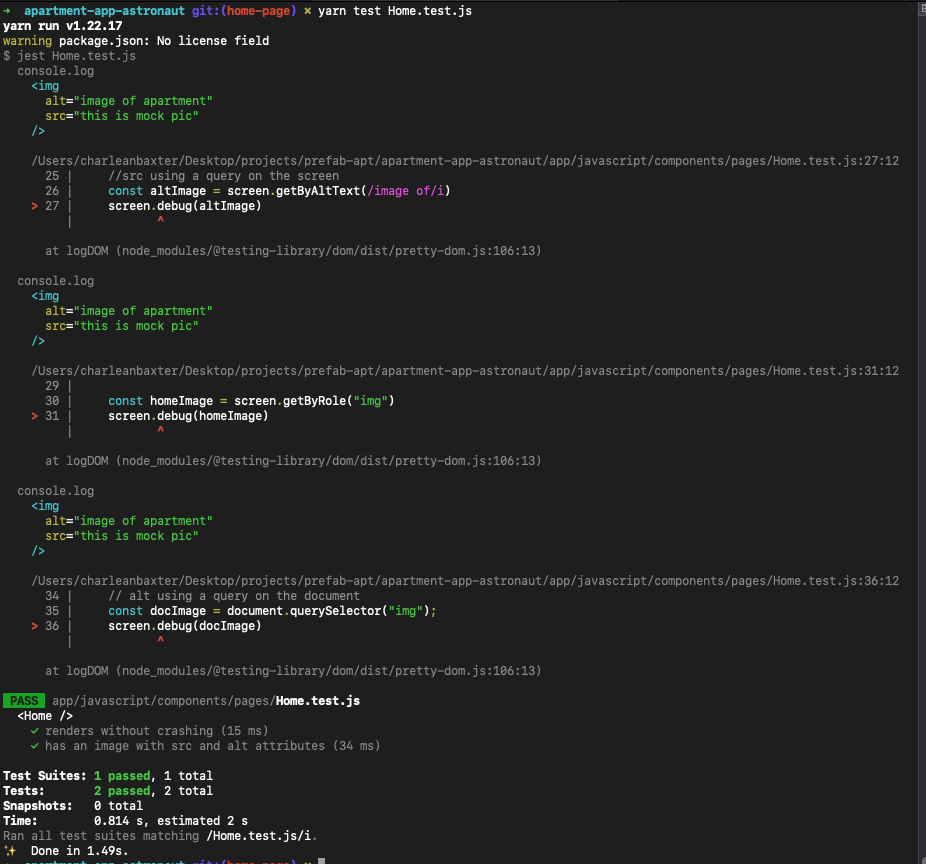

# 🏘 Apartment App

This app has been created for you to mimic the feeling of entering into a developer role where there is established code that you have not created. This apartment application has a few features that have been created for you and some key items that have been left totally untouched. Part of your job as a developer is to be able to pick up code that has already been created, understand what is going on with it, and continue the development of that code.

## 👨‍💻 How We Got Here

```
$ rails new apartment-app -d postgresql -T
$ cd apartment-app
$ rails db:create
$ bundle add rspec-rails
$ rails generate rspec:install
$ bundle add webpacker
$ bundle add react-rails
$ rails webpacker:install
$ rails webpacker:install:react
$ yarn add @babel/preset-react
$ yarn add @rails/activestorage
$ yarn add @rails/ujs
$ rails generate react:install
$ rails generate react:component App
$ bundle add devise
$ rails generate devise:install
$ rails generate devise User
$ rails db:migrate
$ rails generate controller Home index
```

## 🛠 Configurations

### Apartment Resource

The Devise User model is going to have an association with the Apartment model. In this situation, the User will have many apartments and the Apartments will belong to a User.

```bash
rails generate resource Apartment street:string city:string state:string manager:string email:string price:string bedrooms:integer bathrooms:integer pets:string image:text user_id:integer
rails db:migrate
```

### User and Apartment Associations

The Apartments will belong to a User and a User will have many apartments.

**app/models/apartment.rb**

```ruby
class Apartment < ApplicationRecord
  belongs_to :user
end
```

**app/models/user.rb**

```ruby
class User < ApplicationRecord
  # Include default devise modules. Others available are:
  # :confirmable, :lockable, :timeoutable, :trackable and :omniauthable
  devise :database_authenticatable, :registerable,
         :recoverable, :rememberable, :validatable
  has_many :apartments
end
```

### Devise Config

**config/environments/development.rb**

```ruby
This line added:
config.action_mailer.default_url_options = { host: 'localhost', port: 3000 }
```

**config/initializers/devise.rb**

```ruby
# This line replaced:
config.sign_out_via = :delete
# With this line:
config.sign_out_via = :get
```

Add this code into the following file:

**app/views/home/index.html.erb**

```javascript
<%= react_component 'App', {
  logged_in: user_signed_in?,
  current_user: current_user,
  new_user_route: new_user_registration_path,
  sign_in_route: new_user_session_path,
  sign_out_route: destroy_user_session_path
} %>
```

### React in Rails Config

**app/views/layouts/application.html.erb**

```ruby
# This line replaced:
<%= javascript_importmap_tags %>
# With this line:
<%= javascript_pack_tag 'application', 'data-turbolinks-track': 'reload' %>
```

**config/routes.rb**

```ruby
# These lines added:
get '*path', to: 'home#index', constraints: ->(request){ request.format.html? }
root 'home#index'
```

### React Routing Config

```bash
yarn add react-router-dom
```

**app/javascript/components/App.js**

```javascript
import { BrowserRouter, Routes, Route } from "react-router-dom"
```

### Reactstrap Config

```bash
bundle add bootstrap
mv app/assets/stylesheets/application.css app/assets/stylesheets/application.scss
yarn add reactstrap
```

**app/assets/stylesheets/application.scss**

```css
@import "bootstrap";
```

## ⚡️ Getting Started

Once you're able to clone the repository, within the root of the project directory, run:

```bash
bundle
yarn
rails db:setup
```

## 🏁 Start the App

```bash
rails s
```

See what is available already in the application.

- What can a USER do?
devise, all the pages in url, 
- What views (pages, components) are available?

## 🚗 Testing

To run the existing testing suite, run:

```bash
yarn test
rspec spec
```

----------------------Failing rspec
```bash
  1) Apartment should have a valid street
     Failure/Error: expect(apartment.errors[:street]).to include "can't be blank"
       expected [] to include "can't be blank"
     # ./spec/models/apartment_spec.rb:18:in `block (2 levels) in <top (required)>'

  2) Apartments GET /index gets all the apartments
     Failure/Error: get "/apartments"
     
     AbstractController::ActionNotFound:
       The action 'index' could not be found for 
       ApartmentsController
```
--------------corrections
```ruby
  # https://github.com/learn-academy-2022-foxtrot/Syllabus/blob/main/rails/validations.md
  # setup test in ./spec/models/apartment_spec.rb
  # update validation in ./app/models/apartment.rb

  # request tests the controllers code, but also the full stack of a HTTP request, including, routing, views even the rack.
```

## 🧹 Linting
To run the linter and find errors in React, run:

```bash
yarn eslint .
```

To run the linter and find errors in Rails, run:

```bash
standardrb
```

To fix errors tag `--fix` to the end of each command

### Apartment Data Specs

Part of your responsibility will be to build out robust tests both for models and for requests.
Tests you will need are:

REQUEST:

- to ensure a user can see all apartments
- to ensure a user can see all apartments that belong to them
- to ensure a user can make a new apartment
- to ensure a user can update an apartment
- to ensure a user can remove an apartment
- to ensure a user cannot make a new apartment with nil values
- to ensure an error will be thrown if an unregistered user tried to make an apartment
- to ensure an error will be thrown if a user tries to edit an apartment that doesn't belong to them
- to ensure an error will be thrown if a user tries to delete an apartment that doesn't belong to them

MODELS:

- to ensure apartment is valid
- to ensure a user cannot make a new apartment with nil values
- to ensure a user cannot make a new apartment that already exists in the database
- to ensure a user cannot update an apartment with nil values
- to ensure a user cannot update another user's apartment


## Examples for controller methods, spec folder testing
```ruby
# controllers
  def index
    apartments = Apartment.all
    render json: apartments
  end

  def create
    apartment = Apartment.create(apartment_params)
    if apartment.valid?
      render json: apartment
    else
      render json: apartment.errors, status: 422
    end
  end
  
  def destroy
    apartment = Apartment.find(params[:id])
    if apartment.destroy
      render json: apartment
    else
      render json: apartment.errors, status: 422
    end
  end

  private
  def apartment_params
    params.require(:apartment).permit(:street, :city, :state, :manager, :email, :price, :bedrooms, :bathrooms, :pets, :user_id)
  end


  # spec/models
    let(:user) { User.create email: 'sarah@test.com', password: '123456', password_confirmation: '123456' }

  it 'should have a valid street' do
    apartment = Apartment.create city: 'London', state: 'England', manager: 'Ms. Hudson', email: 'mzhud@email.com', price: '1000', bedrooms: 2, bathrooms: 2, pets: 'no', user_id: user.id
    expect(apartment.errors[:street]).to include "can't be blank"
  end
  it 'should have a valid city' do
    apartment = Apartment.create street: '221B Baker Street', state: 'England', manager: 'Ms. Hudson', email: 'mzhud@email.com', price: '1000', bedrooms: 2, bathrooms: 2, pets: 'no', user_id: user.id
    expect(apartment.errors[:city]).to include "can't be blank"
  end
  it 'should have a valid state' do
    apartment = Apartment.create street: '221B Baker Street', city: 'London', manager: 'Ms. Hudson', email: 'mzhud@email.com', price: '1000', bedrooms: 2, bathrooms: 2, pets: 'no', user_id: user.id
    expect(apartment.errors[:state]).to include "can't be blank"
  end
  it 'should have a valid manager' do
    apartment = Apartment.create street: '221B Baker Street', city: 'London', state: 'England', email: 'mzhud@email.com', price: '1000', bedrooms: 2, bathrooms: 2, pets: 'no', user_id: user.id
    expect(apartment.errors[:manager]).to include "can't be blank"
  end
  it 'should have a valid email' do
    apartment = Apartment.create street: '221B Baker Street', city: 'London', state: 'England', manager: 'Ms. Hudson', price: '1000', bedrooms: 2, bathrooms: 2, pets: 'no', user_id: user.id
    expect(apartment.errors[:email]).to include "can't be blank"
  end
  it 'should have a valid price' do
    apartment = Apartment.create street: '221B Baker Street', city: 'London', state: 'England', manager: 'Ms. Hudson', email: 'mzhud@email.com', bedrooms: 2, bathrooms: 2, pets: 'no', user_id: user.id
    expect(apartment.errors[:price]).to include "can't be blank"
  end
  it 'should have a valid bedrooms' do
    apartment = Apartment.create street: '221B Baker Street', city: 'London', state: 'England', manager: 'Ms. Hudson', email: 'mzhud@email.com', price: '1000', bathrooms: 2, pets: 'no', user_id: user.id
    expect(apartment.errors[:bedrooms]).to include "can't be blank"
  end
  it 'should have a valid bathrooms' do
    apartment = Apartment.create street: '221B Baker Street', city: 'London', state: 'England', manager: 'Ms. Hudson', email: 'mzhud@email.com', price: '1000', bedrooms: 2, pets: 'no', user_id: user.id
    expect(apartment.errors[:bathrooms]).to include "can't be blank"
  end
  it 'should have a valid pets' do
    apartment = Apartment.create street: '221B Baker Street', city: 'London', state: 'England', manager: 'Ms. Hudson', email: 'mzhud@email.com', price: '1000', bedrooms: 2, bathrooms: 2, user_id: user.id
    expect(apartment.errors[:pets]).to include "can't be blank"
  end
  it 'should have a valid user' do
    apartment = Apartment.create street: '221B Baker Street', city: 'London', state: 'England', manager: 'Ms. Hudson', email: 'mzhud@email.com',price: '1000', bedrooms: 2, bathrooms: 2, pets: 'no'
    expect(apartment.errors[:user]).to include "must exist"
  end


  # spec/request
    let(:user) do
    User.create email: 'sarah@test.com', password: '123456', password_confirmation: '123456'
  end

  # -----index-----
  describe "GET /index" do
    it 'gets all the apartments' do
      Apartment.create street: '221c Baker Street', city: 'London', state: 'England', manager: 'Ms. Hudson', email: 'mzhud@email.com', price: '1000', bedrooms: 2, bathrooms: 2, pets: 'no', user_id: user.id

      get '/apartments'

      apartments = JSON.parse(response.body)
      expect(apartments.length).to eq 1
      expect(response).to have_http_status(200)

      apartment = apartments.first
      expect(apartment['street']).to eq '221c Baker Street'
      expect(apartment['city']).to eq 'London'
      expect(apartment['state']).to eq 'England'
      expect(apartment['manager']).to eq 'Ms. Hudson'
      expect(apartment['email']).to eq 'mzhud@email.com'
    end
  end
  # -----create-----
    describe "POST /cats" do
      it 'creates a new apartment' do
        apartment_params = {
          apartment: {
            street: '221B Baker Street',
            city: 'London',
            state: 'England',
            manager: 'Ms. Hudson',
            email: 'mzhud@email.com',
            price: '1000',
            bedrooms: 2,
            bathrooms: 2,
            pets: 'no',
            user_id: user.id
          }
        }
        post '/apartments', params: apartment_params

        apartment_response = JSON.parse(response.body)
        expect(apartment_response['street']).to eq '221B Baker Street'
        expect(apartment_response['city']).to eq 'London'
        expect(apartment_response['state']).to eq 'England'
      end

      it 'cannot create a new apartment without a street' do
        apartment_params = {
          apartment: {
            city: 'London',
            state: 'England',
            manager: 'Ms. Hudson',
            email: 'mzhud@email.com',
            price: '1500',
            bedrooms: 2,
            bathrooms: 2,
            pets: 'yes',
            user_id: user.id
          }
        }
        post '/apartments', params: apartment_params
        error_response = JSON.parse(response.body)
        expect(error_response['street']).to include "can't be blank"
        expect(response).to have_http_status(422)
      end

      it 'cannot create a new apartment without a city' do
        apartment_params = {
          apartment: {
            street: '221B Baker Street',
            state: 'England',
            manager: 'Ms. Hudson',
            email: 'mzhud@email.com',
            price: '1500',
            bedrooms: 2,
            bathrooms: 2,
            pets: 'yes',
            user_id: user.id
          }
        }
        post '/apartments', params: apartment_params
        error_response = JSON.parse(response.body)
        expect(error_response['city']).to include "can't be blank"
        expect(response).to have_http_status(422)
      end

      it 'cannot create a new apartment without a state' do
        apartment_params = {
          apartment: {
            street: '221B Baker Street',
            city: 'London',
            manager: 'Ms. Hudson',
            email: 'mzhud@email.com',
            price: '1500',
            bedrooms: 2,
            bathrooms: 2,
            pets: 'yes',
            user_id: user.id
          }
        }
        post '/apartments', params: apartment_params
        apartment = JSON.parse(response.body)
        error_response = JSON.parse(response.body)
        expect(error_response['state']).to include "can't be blank"
        expect(response).to have_http_status(422)
      end

      it 'cannot create a new apartment without a manager' do
        apartment_params = {
          apartment: {
            street: '221B Baker Street',
            city: 'London',
            state: 'England',
            email: 'mzhud@email.com',
            price: '1500',
            bedrooms: 2,
            bathrooms: 2,
            pets: 'yes',
            user_id: user.id
          }
        }
        post '/apartments', params: apartment_params
        error_response = JSON.parse(response.body)
        expect(error_response['manager']).to include "can't be blank"
        expect(response).to have_http_status(422)
      end

      it 'cannot create a new apartment without an email' do
        apartment_params = {
          apartment: {
            street: '221B Baker Street',
            city: 'London',
            state: 'England',
            manager: 'Ms. Hudson',
            price: '1500',
            bedrooms: 2,
            bathrooms: 2,
            pets: 'yes',
            user_id: user.id
          }
        }
        post '/apartments', params: apartment_params
        error_response = JSON.parse(response.body)
        expect(error_response['email']).to include "can't be blank"
        expect(response).to have_http_status(422)
      end

      it 'cannot create a new apartment without a price' do
        apartment_params = {
          apartment: {
            street: '221B Baker Street',
            city: 'London',
            state: 'England',
            manager: 'Ms. Hudson',
            email: 'mzhud@email.com',
            bedrooms: 2,
            bathrooms: 2,
            pets: 'yes',
            user_id: user.id
          }
        }
        post '/apartments', params: apartment_params
        error_response = JSON.parse(response.body)
        expect(error_response['price']).to include "can't be blank"
        expect(response).to have_http_status(422)
      end

      it 'cannot create a new apartment without bedrooms' do
        apartment_params = {
          apartment: {
            street: '221B Baker Street',
            city: 'London',
            state: 'England',
            manager: 'Ms. Hudson',
            email: 'mzhud@email.com',
            price: '1500',
            bathrooms: 2,
            pets: 'yes',
            user_id: user.id
          }
        }
        post '/apartments', params: apartment_params
        error_response = JSON.parse(response.body)
        expect(error_response['bedrooms']).to include "can't be blank"
        expect(response).to have_http_status(422)
      end

      it 'cannot create a new apartment without bathrooms' do
        apartment_params = {
          apartment: {
            street: '221B Baker Street',
            city: 'London',
            state: 'England',
            manager: 'Ms. Hudson',
            email: 'mzhud@email.com',
            price: '1500',
            bedrooms: 2,
            pets: 'yes',
            user_id: user.id
          }
        }
        post '/apartments', params: apartment_params
        error_response = JSON.parse(response.body)
        expect(error_response['bathrooms']).to include "can't be blank"
        expect(response).to have_http_status(422)
      end

      it 'cannot create a new apartment without pets' do
        apartment_params = {
          apartment: {
            street: '221B Baker Street',
            city: 'London',
            state: 'England',
            manager: 'Ms. Hudson',
            email: 'mzhud@email.com',
            price: '1500',
            bedrooms: 2,
            bathrooms: 2,
            user_id: user.id
          }
        }
        post '/apartments', params: apartment_params
        error_response = JSON.parse(response.body)
        expect(error_response['pets']).to include "can't be blank"
        expect(response).to have_http_status(422)
      end
    end


    # app/models
    belongs_to :user
    validates :street, :city, :state, :manager, :email, :price, :bedrooms, :bathrooms, :pets, :image, :user_id, presence: true

```

### Protected Index
```javascript
// Make current user available to MyApartment on App.js
import MyApartment from "./pages/MyApartment"

const App = (props) => {

<Route path="/myapartment" element={<MyApartment {...props} apartments={apartments}/>} />

// Accept the props on MyApartment
const MyApartment = ( {current_user, apartments} ) => {
  console.log(current_user)
  console.log(apartments)

// Ensure that only the apartments created by the current user are displayed
  const myApartments = apartments?.filter(apartment => apartment.user_id === current_user.id) 

// Testing the page requires hard coding a current user and apartments assigned to current user id
  beforeEach(() => {

    const current_user = {
      email: "test@example.com",
      password: "password", 
      id: 1
    }
    console.log(current_user)
    const apartments = [
      {
        street: "423 Privet Drive",
        city: "Little Whinging",
        state: "Surrey",
        manager: "Mr. Potter",
        email: "potter@example.com",
        price: 2000,
        bedrooms: 3,
        bathrooms: 2,
        pets: "yes",
        image: "https://c8.alamy.com/comp/B0RJGE/small-bungalow-home-with-pathway-in-addlestone-surrey-uk-B0RJGE.jpg",
        user_id: 1
      },
      {
        street: "15 Yemen Road",
        city: "Yemen",
        state: "Yemen",
        manager: "Mr. Bing",
        email: "bing@example.com",
        price: 1000,
        bedrooms: 3,
        bathrooms: 2,
        pets: "yes",
        image: "https://i.pinimg.com/736x/4f/c1/ce/4fc1ce196ea1412f670d477a026ba2c6--saudi-arabia-drawing-reference.jpg",
        user_id: 1
      },
      {
        street: "742 Evengreen Terrace",
        city: "Springfield",
        state: "Any State",
        manager: "Mr. Simpson",
        email: "simpson@example.com",
        price: 1000,
        bedrooms: 3,
        bathrooms: 2,
        pets: "yes",
        image: "https://upload.wikimedia.org/wikipedia/en/c/ca/742_Evergreen_Terrace.png",
        user_id: 2
      }
    ]

    const myApartments = apartments.filter(apartment => apartment.user_id === current_user.id)

    render(
      <BrowserRouter>
        <MyApartment current_user={current_user} apartments={myApartments}/>
      </BrowserRouter>
    )
  }) 
```

### Troubleshooting
Error Code:

Solution:
Allow the test suite to mock a default response anytime react testing library sees an image import.
create mock data to represent the image file that will be imported for the test. `app/javascript/__mocks__/fileMock.js` 

 Add the following code snippet to fileMock.js:
```javascript 
let mockPic = "this is mock pic"
export default mockPic
```
Ensure the file path to the mock file is correct on the moduleNameMapper in the jest configuration on package.json. `rootDir` will automatically populate with the path that leads to your application. However, you will need to ensure the correct folder and files are appended after <rootDir>
  `  "moduleNameMapper": {
      "\\.(jpg|jpeg|png|gif|eot|otf|webp|svg|ttf|woff|woff2|mp4|webm|wav|mp3|m4a|aac|oga)$": "<rootDir>/app/javascript/__mocks__/fileMock.js",
      "\\.(css|less)$": "<rootDir>/app/javascript/__mocks__/styleMock.js"
    } ` 

It is not necessary to import the mock data on the test file because moduleNameMapper will automatically response when the test suite looks for an image import.
https://stackoverflow.com/questions/46898638/importing-images-breaks-jest-test 
https://jestjs.io/docs/webpack

    render(
      <BrowserRouter>
        <Navigation logged_in={true} sign_out_route="/users/sign_out"/>
      </BrowserRouter>
    )

    // sign out
    const outLink = screen.queryByText(/sign out/i)
    screen.debug(outLink)
    expect(outLink.getAttribute('href')).toBe("/users/sign_out");

Ways to test html elements on react pages:
- screen.debug() Shows the document currently being rendered


- screen.logTestingPlaygroundURL() It creates a sandbox area of the component that is being rendered on your test. When you hover over the different elements, a query is given to you of how to test that section. 
[](https://youtu.be/VPtUXCWV_g0)
- testing in put values on a html form
https://www.cluemediator.com/test-an-input-field-using-the-react-testing-library 
https://noriste.github.io/reactjsday-2019-testing-course/book/react-testing-library/custom-input.html

### Create functionality issues
- Ensure mock data has primary and foreign keys hard coded.
```javascript
  {
    id: 1,
    street: "4 Privet Drive",
    city: "Little Whinging",
    state: "Surrey",
    manager: "Mr. Potter",
    email: "potter@example.com",
    price: 2000,
    bedrooms: 3,
    bathrooms: 2,
    pets: "yes",
    image:
      "https://c8.alamy.com/comp/B0RJGE/small-bungalow-home-with-pathway-in-addlestone-surrey-uk-B0RJGE.jpg",
    user_id: 1 
  }
```

## Scary warning
- Don't fret just a security measure for fake web sites
```bash
apartment/fake.org:1          GET https://apartment/fake.org net::ERR_NAME_NOT_RESOLVED
```